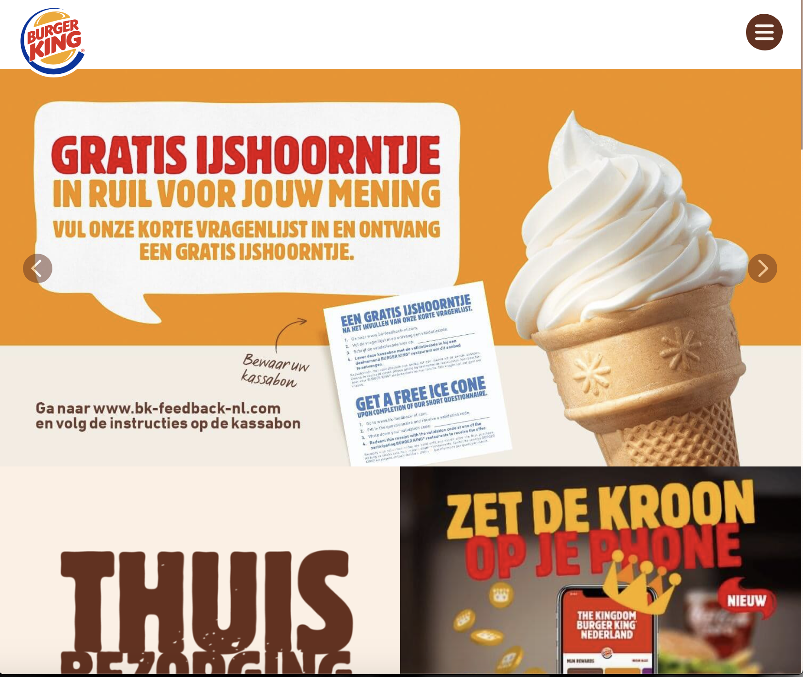

# Procesverslag
**Auteur:Janelle Groenendijk (500800949)

Markdown cheat cheet: [Hulp bij het schrijven van Markdown](https://github.com/adam-p/markdown-here/wiki/Markdown-Cheatsheet). Nb. de standaardstructuur en de spartaanse opmaak zijn helemaal prima. Het gaat om de inhoud van je procesverslag. Besteedt de tijd voor pracht en praal aan je website.

## Bronnenlijst
1. -bron 1-
2. -bron 2-
3. -...-

## Eindgesprek (week 7/8)

-dit ging goed & dit was lastig-

**Screenshot(s):**

-screenshot(s) van je eindresultaat-

## Voortgang 3 (week 6)

-same as voortgang 1-

## Voortgang 2 (week 5)

## Voortgang 1 (week 3)

### ADVIES MEZELF AANKOMENDE WEKEN
Het lijkt mij handig om in de aankomende weken meer contact op te nemen met de studentassistent zodat hij mij kan gaan helpen met begrippen die ik niet snap of die nog niet helemaal duidelijk voor mij zijn.

### WEEK 3
Helaas kon ik deze week ook weer niet in een les aanwezig zijn door een onderzoek in het ziekenhuis.
Maar ik heb wel thuis de oefeningen geprobeerd. Javascript vind ik heel lastig dus het ging mij niet heel goed af. Maar doordat ik dit blok 6 vakken aan het doen ben, heb ik nog geen contact opgenomen met de student assistent. Wel heb ik verder gewerkt in de CSS aan de mobiele versie van de eerste pagina van mijn website.

### WEEK 2
In week 2 hebben we het gehad over position en flexbox. Dit is iets waar ik zelf het meeste moeite mee heb. Dat komt doordat je heel veel verschillende soorten begrippen daarin hebt en het voor mij dan onduidelijk is wanneer iets wat doet. 
Wat echt heel fijn was is dat we een oefening kregen genaamd flexbox froggy. Dit was een hele fijne oefening omdat je stapje voor stapje een stukje theorie kreeg met een opdracht. Heel fijn om als basis te hebben, je kunt namelijk altijd terug vallen op flexbox froggy om even te kijken wat ook al weer wat was.

### WEEK 1
Gelukkig ging het in week 1 kwa stof wel goed omdat ik typografie wel snap. Het enige wat ik nog steeds heel lastig vind, is de lettergrootte. Dat is iets waar ik me nog even in moet gaan verdiepen.

### Stand van zaken

Door medische omstandigheden heb ik de eerste week heel rustig aan gedaan. Front-end is voor mij sowieso een lastig vak doordat ik vaak extra uitleg nodig heb voordat ik iets snap. 

Het was even lastig voor ik ook op een rijtje had voor mezelf wanneer welke les was en wat je ervoor moest doen. Naar mijn idee was het allemaal een beetje rommelig doordat je in teams in een inhaalklas groep zit, maar die inhaalklas voor verschillende vakken kan zijn waardoor alles door elkaar heen loopt. 

Het fijne is dat ik nog een deel van mijn code van vorig jaar heb waar ik verder aan kan werken, zo hoef ik niet helemaal opnieuw te beginnen.

## Intake (week 1)

**Je startniveau:** blauw

**Je focus:** -kies uit responsive óf surface plane, ik weet niet wat surface plane is dus dat wil ik eerst weten voor ik er eentje kies. -

**Je opdracht:** https://www.burgerking.nl 

**Screenshot(s)

**Breakdown-schets(en): 
uitgeschreven
hoofdpagina: header - main - nav - li - ul - a - img - section - h1 - img - p - section - h2- h3 - img - section - h2 - img - section - h2 - p - img - section - p - img - img - section h2 - img - p - img - section - h2 - img - section - img - p - img - section - h2 - p - img - img - img - section - h2 - li - ul - img - img -img - footer - li - ul - a 
(images/breakdown.jpg)

<!--[-voorlopige breakdownschets(en) van een of beide pagina's van de site die je gaat maken-](images/dummy-image.svg)
